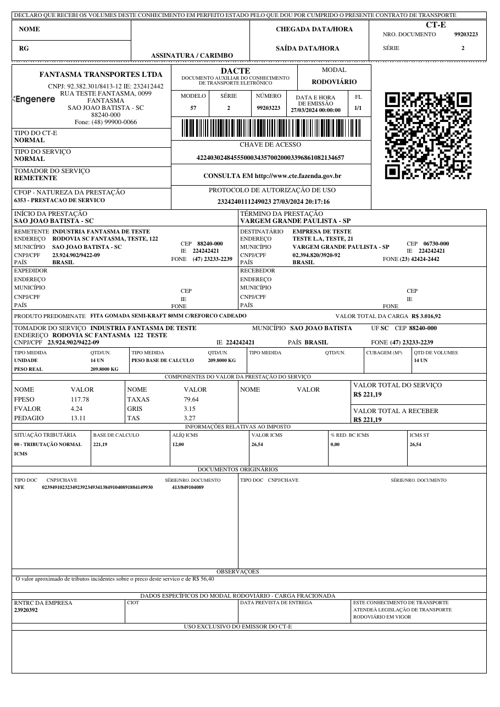

DACTE (Auxiliary Document of the Electronic Transportation Bill) is a printed document used in Brazil to accompany the electronic transportation invoice (CT-e). It serves as a simplified version of the CT-e, providing key details about the shipment, such as cargo information, sender and receiver, and transport company data. All transport modes are supported — road, air, water, rail, pipeline and multimodal.

{ width="480" }

## Basic Usage

=== "Python"

    ```python
    from brazilfiscalreport.dacte import Dacte

    # Path to the XML file
    xml_file_path = 'cte.xml'

    # Load XML Content
    with open(xml_file_path, "r", encoding="utf8") as file:
        xml_content = file.read()

    # Instantiate the DACTE object with the loaded XML content
    dacte = Dacte(xml=xml_content)
    dacte.output('output_dacte.pdf')
    ```

=== "CLI"

    ```bash
    bfrep dacte /path/to/cte.xml
    ```

## Customizing DACTE 🎨

This section describes how to customize the PDF output of the DACTE using the `DacteConfig` class. You can adjust various settings such as margins, fonts, and other options according to your needs.

### Configuration Options ⚙️

Here is a breakdown of all the configuration options available in `DacteConfig`:

---

**Logo**

- **Type**: `str`, `BytesIO`, or `bytes`
- **Description**: Path to the logo file or binary image data to be included in the PDF. You can use a file path string or pass image data directly.
- **Example**:
    ```python
    config.logo = "path/to/logo.jpg"  # Using a file path
    ```
- **Default**: No logo.

---

**Margins**

- **Type**: `Margins`
- **Fields**: `top`, `right`, `bottom`, `left` (all of type `Number`)
- **Description**: Sets the page margins for the PDF document, in millimeters.
- **Example**:
    ```python
    config.margins = Margins(top=5, right=5, bottom=5, left=5)
    ```
- **Default**: top, right, bottom, and left are set to 5 mm.

---

**Font Type**

- **Type**: `FontType` (Enum)
- **Values**: `COURIER`, `TIMES`
- **Description**: Font style used throughout the PDF document.
- **Example**:
    ```python
    config.font_type = FontType.COURIER
    ```
- **Default**: `TIMES`

---

**Display IBS/CBS**

- **Type**: `bool`
- **Description**: When set to `True`, adds an "IBS E CBS" column to the tax information block, showing the state IBS, municipal IBS and CBS rates and amounts extracted from the `IBSCBS` group of the CT-e XML (Brazilian tax reform — Reforma Tributária).
- **Example**:
    ```python
    config.display_ibs_cbs = True
    ```
- **Default**: `False`

---

**Receipt Position**

- **Type**: `ReceiptPosition` (Enum)
- **Values**: `TOP`, `BOTTOM`, `LEFT`
- **Example**:
    ```python
    config.receipt_pos = ReceiptPosition.BOTTOM
    ```
- **Default**: `TOP`

!!! warning
    This option is not yet implemented for the DACTE: the receipt is always rendered at the top, and the layout is determined automatically by the print orientation (`tpImp`) of the CT-e XML. Setting it currently has no effect on the output.

---

**Decimal Configuration**

- **Type**: `DecimalConfig`
- **Fields**: `price_precision`, `quantity_precision` (both `int`)
- **Example**:
    ```python
    config.decimal_config = DecimalConfig(price_precision=2, quantity_precision=2)
    ```
- **Default**: `4` for both fields.

!!! warning
    This option is not yet implemented for the DACTE: monetary values are always formatted with 2 decimal places. Setting it currently has no effect on the output.

---

**Watermark Cancelled**

- **Type**: `bool`
- **Description**: When set to `True`, displays a "CANCELADA" watermark on the DACTE for cancelled documents. If the XML belongs to the homologation environment, the text becomes "CANCELADA - SEM VALOR FISCAL".
- **Example**:
    ```python
    config.watermark_cancelled = True
    ```
- **Default**: `False`

!!! note
    Independently of this setting, a "SEM VALOR FISCAL" watermark is drawn automatically whenever the XML has no authorization protocol (`protCTe`) or was issued in the homologation environment (`tpAmb` = 2). When `watermark_cancelled=True`, the cancellation watermark takes precedence.

---

### Usage Example with Customization

Here's how to set up a `DacteConfig` object with a full set of customizations:

```python
from brazilfiscalreport.dacte import (
    Dacte,
    DacteConfig,
    FontType,
    Margins,
)

# Path to the XML file
xml_file_path = 'cte.xml'

# Load XML Content
with open(xml_file_path, "r", encoding="utf8") as file:
    xml_content = file.read()

# Create a configuration instance
config = DacteConfig(
    logo='path/to/logo.png',
    margins=Margins(top=10, right=10, bottom=10, left=10),
    font_type=FontType.TIMES,
    display_ibs_cbs=True,
)

# Use this config when creating a Dacte instance
dacte = Dacte(xml_content, config=config)
dacte.output('output_dacte.pdf')
```
