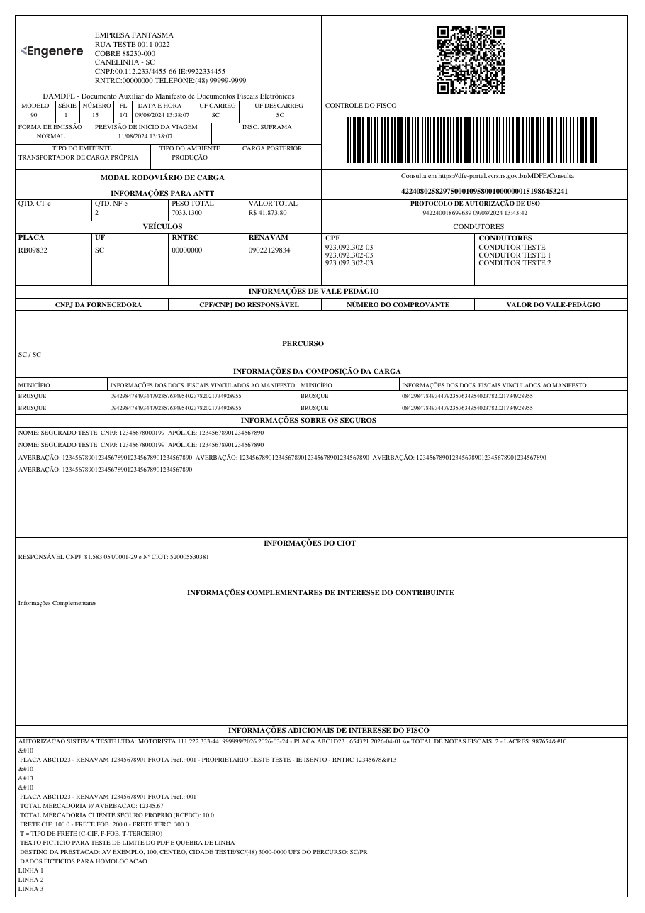

DAMDFE (Auxiliary Document of the Electronic Manifest of Fiscal Documents) is a printed representation of the MDF-e (Electronic Manifest of Fiscal Documents) used in Brazil. It consolidates information about the transportation of goods, linking multiple CT-e or NF-e documents to a single transport operation, and is required to accompany the cargo during transit. Road, air, water and rail modes are supported, including contingency emission.

{ width="480" }

## Basic Usage

=== "Python"

    ```python
    from brazilfiscalreport.damdfe import Damdfe

    # Path to the XML file
    xml_file_path = 'mdfe.xml'

    # Load XML Content
    with open(xml_file_path, "r", encoding="utf8") as file:
        xml_content = file.read()

    # Instantiate the DAMDFE object with the loaded XML content
    damdfe = Damdfe(xml=xml_content)

    # Save the generated PDF to a file
    damdfe.output('damdfe.pdf')
    ```

=== "CLI"

    ```bash
    bfrep damdfe /path/to/mdfe.xml
    ```

## Customizing DAMDFE 🎨

This section describes how to customize the PDF output of the DAMDFE using the `DamdfeConfig` class. You can adjust various settings such as margins and fonts according to your needs.

### Configuration Options ⚙️

Here is a breakdown of all the configuration options available in `DamdfeConfig`:

---

**Logo**

- **Type**: `str`, `BytesIO`, or `bytes`
- **Description**: Path to the logo file or binary image data to be included in the PDF. You can use a file path string or pass image data directly.
- **Example**:
    ```python
    config.logo = "path/to/logo.jpg"  # Using a file path
    ```
- **Default**: No logo.

---

**Margins**

- **Type**: `Margins`
- **Fields**: `top`, `right`, `bottom`, `left` (all of type `Number`)
- **Description**: Sets the page margins for the PDF document, in millimeters.
- **Example**:
    ```python
    config.margins = Margins(top=10, right=10, bottom=10, left=10)
    ```
- **Default**: top, right, bottom, and left are set to 5 mm.

!!! warning
    The DAMDFE layout currently supports integer margins only: left between 5 and 10 mm (values outside this range raise an error for road documents) and right between 1 and 10 mm (values outside this range raise an error for all documents).

---

**Display Origin/Destination of Service**

- **Type**: `bool`
- **Description**: When set to `True`, the "PERCURSO" section also displays the origin of the service (loading municipality, from `infMunCarrega`) and the destination of the service (unloading municipalities, from `infMunDescarga`).
- **Example**:
    ```python
    config.display_origem_destino_prestacao = True
    ```
- **Default**: `False`

---

**Decimal Configuration**

- **Type**: `DecimalConfig`
- **Fields**: `price_precision`, `quantity_precision` (both `int`)
- **Example**:
    ```python
    config.decimal_config = DecimalConfig(price_precision=2, quantity_precision=2)
    ```
- **Default**: `4` for both fields.

!!! warning
    This option is not yet implemented for the DAMDFE: values are always formatted with 2 decimal places. Setting it currently has no effect on the output.

---

**Font Type**

- **Type**: `FontType` (Enum)
- **Values**: `COURIER`, `TIMES`
- **Description**: Font style used throughout the PDF document.
- **Example**:
    ```python
    config.font_type = FontType.COURIER
    ```
- **Default**: `TIMES`

---

### Automatic Behaviors

Some elements are rendered automatically based on the XML content, with no configuration needed:

- A "SEM VALOR FISCAL" watermark is drawn whenever the XML has no authorization protocol (`protMDFe`) or was issued in the homologation environment (`tpAmb` = 2).
- For contingency emission (`tpEmis`), an "EMISSÃO EM CONTINGÊNCIA" watermark is drawn and the protocol box shows the 168-hour authorization deadline computed from the emission date.

!!! note
    Unlike DANFE, DACTE and DANFSE, the DAMDFE does not offer a `watermark_cancelled` option yet.

---

### Usage Example with Customization

Here's how to set up a `DamdfeConfig` object with a full set of customizations:

```python
from brazilfiscalreport.damdfe import (
    Damdfe,
    DamdfeConfig,
    FontType,
    Margins,
)

# Path to the XML file
xml_file_path = 'mdfe.xml'

# Load XML Content
with open(xml_file_path, "r", encoding="utf8") as file:
    xml_content = file.read()

# Create a configuration instance
config = DamdfeConfig(
    logo='path/to/logo.png',
    margins=Margins(top=10, right=10, bottom=10, left=10),
    font_type=FontType.TIMES,
    display_origem_destino_prestacao=True,
)

# Use this config when creating a Damdfe instance
damdfe = Damdfe(xml_content, config=config)
damdfe.output('output_damdfe.pdf')
```
