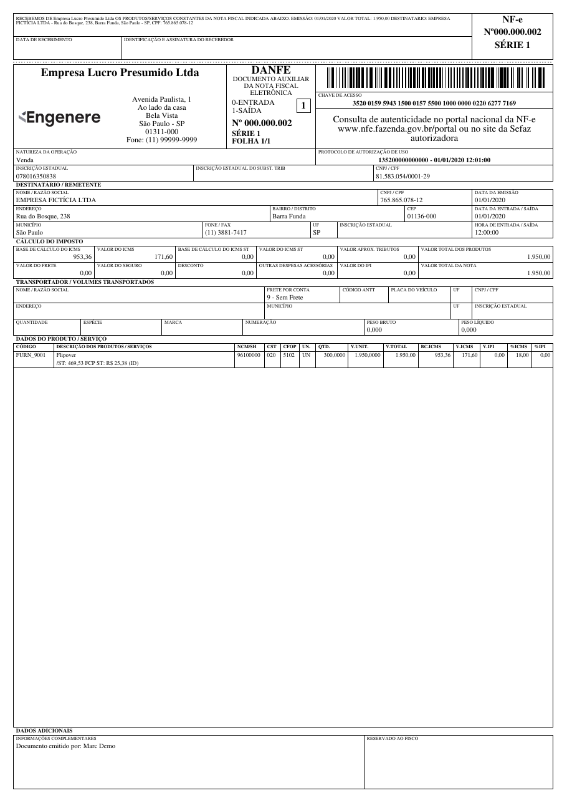
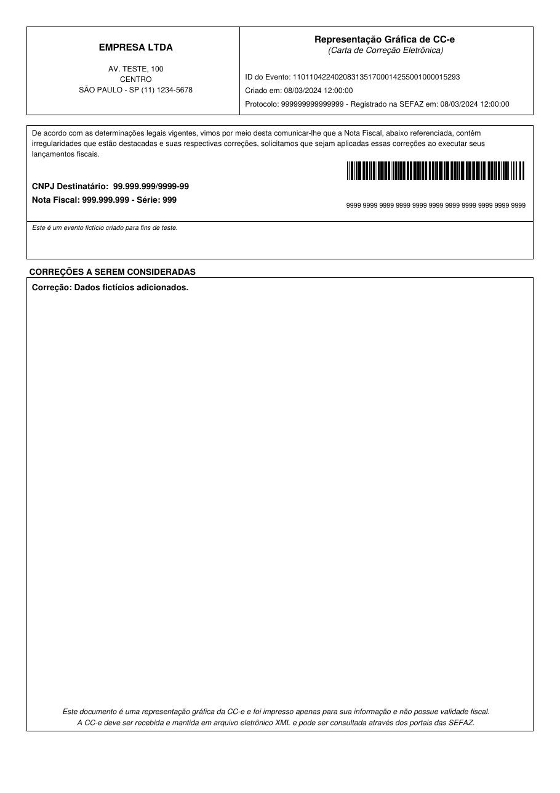
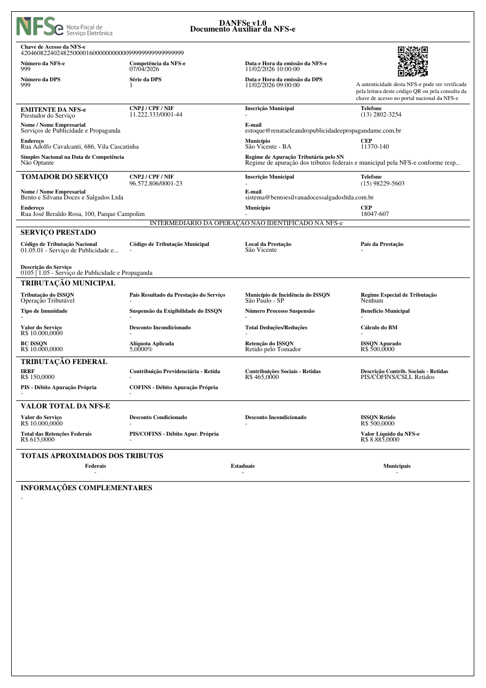

# Brazil Fiscal Report

Python library for generating Brazilian auxiliary fiscal documents in PDF from XML documents.

## Supported Documents

| Preview | Document | XML Source |
|:---:|----------|:---:|
| [{ width="120" }](danfe.md) | [**DANFE**](danfe.md) — Documento Auxiliar da Nota Fiscal Eletrônica | NF-e |
| [{ width="120" }](dacte.md) | [**DACTE**](dacte.md) — Documento Auxiliar do Conhecimento de Transporte Eletrônico | CT-e |
| [{ width="120" }](damdfe.md) | [**DAMDFE**](damdfe.md) — Documento Auxiliar do Manifesto Eletrônico de Documentos Fiscais | MDF-e |
| [{ width="120" }](dacce.md) | [**DACCe**](dacce.md) — Documento Auxiliar da Carta de Correção Eletrônica | CC-e |
| [{ width="120" }](danfse.md) | [**DANFSE**](danfse.md) — Documento Auxiliar da Nota Fiscal de Serviços Eletrônica | NFS-e |

## Usage Modes

### 1. Python Code

For full customization and integration, use the library directly in Python. Configure margins, fonts, receipt positions, and more for each document type.

[Get started :material-arrow-right:](getting-started.md){ .md-button }

### 2. CLI (Command Line)

For quick PDF generation from the terminal with a simple `config.yaml` file.

[CLI documentation :material-arrow-right:](cli.md){ .md-button }

### 3. Try it Online

Upload your fiscal XML and get the PDF instantly — no installation needed.

[Try it online :material-arrow-right:](https://brazilfiscalreport.streamlit.app){ .md-button }

## Dependencies

- [FPDF2](https://github.com/py-pdf/fpdf2) - PDF creation library for Python
- [phonenumbers](https://github.com/daviddrysdale/python-phonenumbers) - Phone number formatting
- [python-barcode](https://github.com/WhyNotHugo/python-barcode) - Barcode generation
- [qrcode](https://github.com/lincolnloop/python-qrcode) - QR code generation (required for DACTE, DAMDFE and DANFSE)
